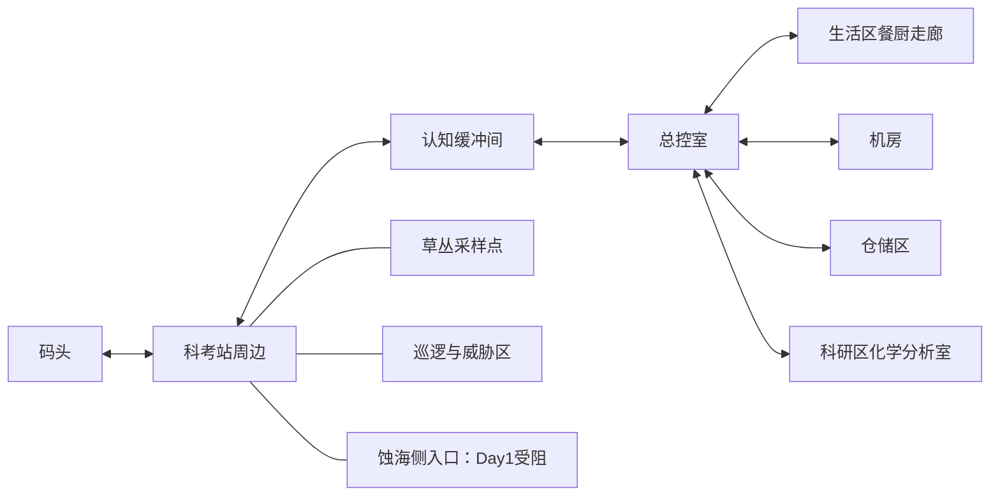

# Day1 剧情细纲：入驻科考站

版本：2026-10-04 整理稿。

本稿依据已提供的六日大纲、人物与背景设定、Day1 具体流程和科考站结构图整理。地图区域、事件顺序、角色位置和任务类型沿用原稿；具体台词、测试题、规则条目、交互物品细分及隐藏线索均为可修改的文案草案。本文是制作清单，不表示相关地图、任务和演出已经实现。

## 1. 当日目标与信息边界

第一日承担四项作用：完成入站手续，建立科考站与周边的空间认知，认识六位同行队员，熟悉采集、交谈、战斗和维修等行动。

玩家所见的日常流程为入驻与常规勘察准备。真实委托是搜救谭礿及其船队，但登陆后“本次任务以搜救为目标”的认知被屏蔽。第一日正文不直接讲明真实委托、前队失联、模因掩体或息壤中的先民意识。

固定主线：

**入站认知测试 → 取得身份认证卡 → 总控室宣读注意事项 → 环境数据入包 → 收到物资通知 → 生活区领取物资 → 神秘影子经过 → 开放自由探索 → 当日任务收尾。**

自由探索中的六人交谈和任务不设固定先后。蚀海海水采样在第一日接取，执行明确顺延至第二日。

## 2. 地图场景与绘制范围

这里的“场景”指地图区域与绘制单元，暂不决定拆成多少个 Unity 场景文件。按现有流程，第一日需要 **6 个站内区域、2 个站外区域**。结构图只规定连接关系，大小可按实际走动与演出空间调整。

| 区域 | 用途与角色 | 必需布景 | 主要交互 | 绘制说明 |
| --- | --- | --- | --- | --- |
| A01 认知缓冲间 | 入站检测，桓玉鉴 | 外门、内门、检测终端或面板 | 测试、身份认证卡 | 极小房间；墙上测试屏幕的独立 CG／演出为次要。其他队员可按依次检测处理，无需把七人同时塞进房间 |
| A02 总控室 | 集合、规则说明、环境记录、林溪任务目标 | 中心立柱、围柱终端、环境监测台、通向各区的门 | 规则终端、环境监测台、设备诊断点 | 站内交通中心，给七人集合留空地；诊断点可复用现有终端 |
| A03 生活区走廊／餐厨区 | 领取生活物资，影子伏笔 | 餐桌、工作台、厨具、走廊转角、生活区房门 | 餐桌上的物资 | 餐厅与厨房合用一处；留一条清晰的剪影经过路径，房门可以只画外观 |
| A04 机房 | 林溪检查设备 | 主机、机柜、线缆、操作台 | 林溪 | 简单设备检修空间即可，任务引导玩家返回总控室 |
| A05 科研区／化学分析室 | 水文学家分析水质 | 分析台、样本架、容器、记录终端 | 水文学家；采样准备物可复用分析台 | 化学分析室必须可到达；综合实验台及通道可局部表现，无需展开整个科研区 |
| A06 仓储区 | 收容部安保检修装备 | 货架、装备箱、维修工作台 | 收容部安保、维修台 | 维修检定在此完成，不额外增加作战实验室 |
| A07 科考站周边 | 地质学家采样、杨应隆巡逻、威胁清除、蚀海侧劝阻 | 站外入口、草丛、采样点、巡逻边界、蚀海方向路口 | 两名队员、植物样本、威胁触发点、受阻入口 | 四个功能区可在同一张野外地图内安排；第一日不需要进入蚀海岸线或绘制采水区域 |
| A08 码头 | 机械师检修供电 | 船只／栈桥局部、供电箱、工具箱、零件箱 | 机械师、工具与零件 | 工具零件搜索尽量就近，避免为教学任务新增大面积支线地图 |

建议连接关系：

医疗区、模因实验室、神秘房间、生态实验室、测绘与遥感实验室，以及各双人间不承担当前 Day1 必需事件，暂不绘制内部。主角单人房只有在决定用“回房休息”收尾时才需要新增内部。

## 3. 交互点清单

| 编号 | 区域与交互点 | 触发／前置 | 完成结果 | 文案所在段 |
| --- | --- | --- | --- | --- |
| P01 | A01 认知检测终端 | 新游戏进入，自动触发 | 完成问答 | 4.1 |
| P02 | A01 身份卡输出 | P01 完成，自动交付 | 身份认证卡入包，内门可通行 | 4.1；不增加第二次必做点击 |
| P03 | A02 规则终端 | 入站完成；全员集合 | 宣读完成，队员解散 | 4.2 |
| P04 | A02 环境监测台 | 规则宣读完成 | 环境数据档案入包，收到物资通知 | 4.3 |
| P05 | A03 餐桌物资 | 已收到物资通知 | 完成领取，随后播放影子演出 | 4.4 |
| P06 | A04 林溪 | 自由探索开放 | 人物交谈、接取检查任务 | 5.1 |
| P07 | A02 设备诊断终端 | 林溪任务已接取 | 取得设备检查结果，回报林溪 | 5.1 |
| P08 | A05 水文学家／分析台 | 自由探索开放 | 接取海水采样任务 | 5.2 |
| P09 | A07 地质学家 | 自由探索开放 | 接取植物采样任务 | 5.3 |
| P10 | A07 植物采样点 | 植物任务已接取 | 基础样本、采集检定；可获增益道具 | 5.3；点位数量待定 |
| P11 | A07 杨应隆 | 自由探索开放 | 接取清除威胁任务 | 5.4 |
| P12 | A07 威胁区域 | 清除任务已接取 | 六爻战斗教学、清除结果 | 5.4；敌种待定 |
| P13 | A07 蚀海侧入口 | 第一日试图进入；不依赖先接任务 | 杨应隆劝阻；若已接水样任务，明确顺延 | 5.2 |
| P14 | A06 收容部安保 | 自由探索开放 | 接取装备维修任务 | 5.5 |
| P15 | A06 维修工作台 | 维修任务已接取 | 六爻维修教学、维修结果 | 5.5 |
| P16 | A08 机械师 | 自由探索开放 | 接取工具与零件任务 | 5.6 |
| P17 | A08 工具箱／搜索点 | 机械师任务已接取 | 找到所需工具 | 5.6 |
| P18 | A08 零件箱／搜索点 | 机械师任务已接取 | 找到所需零件；包含检定 | 5.6 |
| P19 | A08 供电箱 | 可选查看；任务完成后状态改变 | 供电情况说明 | 5.6；不额外要求玩家维修 |
| P20 | 收尾交互，建议复用 P03 | 当日结束条件满足 | 确认结束第一日，保留跨日任务 | 6；地点与条件待定 |

物资通知、队员解散、影子经过属于自动事件，不必制作独立可点击物体。P03/P07/P20 可以复用总控室同一组终端；P08 可以合并为与水文学家的交谈。上表用于划分逻辑，不要求每行独立绘制素材。

## 4. 固定主线与文案草案

### 4.1 入站认知测试

**状态与演出：** 主角进入缓冲间，内门暂时闭合，自动打开问答界面。外界海风声逐渐被密闭门隔断。屏幕上题目和选项必须可读；独立屏幕 CG 为次要，可直接用交互 UI 呈现。

以下题目为草案。建议把它作为入站手续与认知主题教学，暂不承担结局判定；选择不匹配项时复核当前题目，避免开局即进入不可恢复分歧。

| 环节 | 屏幕文案 | 选项与回应草案 |
| --- | --- | --- |
| 开始 | 「入站认知校准。请确认当前身份与所处环境。」 | 「开始检测」 |
| Q1 | 「请确认你的姓名。」 | 「桓玉鉴」／「无法确认」。无法确认：「身份记录已调出，请对照认证信息重新确认。」 |
| Q2 | 「你当前所在的位置是？」 | 「科考站认知缓冲间」／「科考船甲板」／「野外采样点」。不匹配：「当前位置识别需要复核，请观察门侧区域标识。」 |
| Q3 | 「记录中出现无法辨认的字段时，应如何处理？」 | 「保留原始记录并报告」／「按印象补写」／「删除该字段」。保留原始记录为建议答案；其余：「请保留未识别信息，避免以推测替代原始记录。」 |
| 结束 | 「当前身份确认完成。精神状态校准完成。身份认证卡已发放。」 | 自动取得认证卡，开放内门 |

身份认证卡物品说明草案：

> 桓玉鉴的入站身份认证卡。用于站内身份核验与出入登记。

重复查看终端：

> 「入站登记已完成。身份认证：桓玉鉴。」

正常重复出入缓冲间不必重播整套开局问答，可用简短核验反馈。是否需要后续认知复测另行设计。

### 4.2 总控室集合与规则宣读

**状态与演出：** 七人围绕中心立柱集合。玩家先交互规则终端，再播放桓玉鉴宣读。此时集体出镜不自动计作六人的个人相识事件，避免自由交谈失去作用。

终端标题：

> 「绥海堰科考站 · 入驻注意事项」

规则条目草案：

> 一、出入科考站须完成身份核验与精神状态检查。
>
> 二、环境异常以原始记录为准，不得仅凭常识修正仪器输出。
>
> 三、记录中的姓名、时间或用途字段若无法读取，应保留原样并报告，不得自行补写或删除。
>
> 四、若出现记忆缺失、读写困难或无法说明当前工作目的，应停止单独作业，联系随队卦者复核。
>
> 五、外围安全确认完成前，不得独自进入蚀海侧作业区。

宣读与散会：

> 桓玉鉴：「各位，先核对站内的注意事项。」
>
> 桓玉鉴：「异常照实记录。记不清的，也照实记录，不要替它找一个解释。」
>
> 桓玉鉴：「林溪，站内设备由你组织检查。其他人先做入驻准备。外围与供电确认后，再安排外出作业。」
>
> 林溪：「明白。我去机房核对设备状态。」
>
> 杨应隆：「我先检查站外边界。」

宣读完成后，各 NPC 前往自由探索中的固定位置。当前目标更新为「查阅环境监测信息」。重复交互终端可阅读规则全文，不再重播散会。

### 4.3 环境信息收集

环境监测台应展示海况、堰体监测、站内状态等记录入口。具体天气、潮位、数值、时间及段号尚未提供，不写入确定数值；涉及科考次数和堰段的编号继续留作待填字段。

监测台文案：

> 「当前环境记录已调出。请保存原始数据后再进行分析。」
>
> 桓玉鉴：「先把这份记录带上。后续采样要和它对照。」

背包获得提示：

> 「获得：环境数据档案」

档案说明：

> 科考站当前保存的环境监测数据，包括海况、堰体与站内设备记录，供后续采样分析对照。

随后自动收到物资通知。原稿只指定发送者为安保人员，尚未确定是哪一位；草稿先使用“安保通讯”，不锁定个人。

> 安保通讯：「生活物资已经放在食堂餐桌上，请过去领取。」
>
> 桓玉鉴：「收到。」

当前目标更新为「前往生活区领取物资」。重复读取监测台可查看原数据，不重复发放档案。

### 4.4 领取物资与影子伏笔

玩家交互餐桌上的物资，完成领取后再播放影子经过。生活物资的具体内容、数量、是否入包尚未确定；目前只保留“生活物资”这一名称，避免提前指定战斗资源。

领取文案：

> 桓玉鉴：「物资放在这里了。」
>
> 「已领取生活物资。」

影子演出草案：

1. 物资交互完成，短暂锁定移动。
2. 走廊转角出现人形剪影，内部被雪花噪点填充。
3. 剪影从视野边缘经过；短促噪声与灯光／画面闪动同步，随后恢复正常。
4. 不显示谭礿姓名、正常头像或可锁定的对话目标；剪影经过后不留下可以持续追踪的站立 NPC。
5. 主角将其归为普通设备异常或光影，继续处理眼前事务。

主角反应草案：

> 桓玉鉴：「灯接触不良么……回头让机房看一下。」

这句只作随口解释，不自动新增“调查影子”或“检修灯具”任务。此处需保持“玩家受到惊扰，主角未产生怀疑”的差别。正文不出现“谭礿”“前科考队”“第八个人”等直接揭底表述。

演出结束后开放自由探索，目标提示：

> 「入驻准备：与队员交谈，确认各处的工作情况。」

影子事件只触发一次；重复查看餐桌为「生活物资已领取」。领取、影子演出与探索开放的完成状态应分别记录，避免在演出中途退出后重复拿取物资或永久跳过事件。

## 5. 六名队员的交谈与任务

人物资料引用现有角色库。四位未命名队员继续显示职能名；涉及真实姓名的台词使用编辑占位「〔姓名待定〕」，上线前填入姓名或改成不需要姓名的句子，不能把占位符直接显示给玩家。

交谈建议包含“确认身份”“正在做什么”“接受任务”三个部分。拒绝或暂不接取后可再次交谈；任务完成后换成完成态对白，不重复发奖。首次人物交谈与任务接取分别记状态，认识某人不要求必须接受其任务。

### 5.1 林溪：检查总控室

位置：机房。当前活动：检查站内设备。

> 桓玉鉴：「林溪，站内设备怎么样？」
>
> 林溪：「几路信息还没接顺。我先核对机房，你替我看看总控室的终端状态。」
>
> 桓玉鉴：「需要查哪些？」
>
> 林溪：「先确认各终端能否正常读取。拿到原始检查结果就回来，别急着替记录下结论。」

接取按钮：「去检查总控室」／「稍后再来」。任务栏：「检查总控室状况」。

流程：交谈接取 → 返回总控室 → 读取设备诊断终端 → 完成采集／检定 → 将检查结果回报林溪。

诊断终端基础反馈：

> 「终端状态已读取。检查结果已保存。」

检定成功草案：

> 「你从交错的数据中整理出了可用于后续检查的记录。」

检定失败草案：

> 「你取得了基础检查结果，但未能整理出额外可用的记录。」

回报：

> 林溪：「有这份结果，我就能把各路信息接起来。谢谢。」

建议基础任务允许完成，成功检定额外给予增益道具；道具暂名“校验记录”，作用方向为后续信息整理／研究辅助，数值与持续时间待定。是否采用该失败兜底方式仍属任务设计草案。

进行中重复对白：

> 林溪：「总控室的检查结果拿到了么？」

完成后：

> 林溪：「设备状态已经对上了。遇到读不出的记录，先留着，我会再看。」

### 5.2 水文学家：海水采样，顺延 Day2

位置：化学分析室。当前活动：分析水质。

> 水文学家：「青龙馆，水文方向。叫我〔姓名待定〕就好。」
>
> 桓玉鉴：「我记下了。这里有什么需要准备的？」
>
> 水文学家：「我要把新取的海水样本和站里的环境记录对照。你方便时，替我带一份蚀海海水回来。」
>
> 桓玉鉴：「取样要求也一并给我。」
>
> 水文学家：「位置、时间和容器状态都要记录。样本有异常，别自行处理，直接带回原始记录。」

接取按钮：「接下采样任务」／「稍后再来」。任务栏：「采集蚀海海水样本」。采样容器是否作为独立物品发放、是否需在分析台领取，待定；即使发放也可复用分析台。

第一日前往蚀海侧时：

> 杨应隆：「停一下。蚀海侧今天还不能进去。」
>
> 桓玉鉴：「化学分析室要一份水样。」
>
> 杨应隆：「先等外围确认。采样明天再安排，今天不要单独过去。」
>
> 桓玉鉴：「好，我先回去做准备。」

如果还未接水样任务，只播放入口劝阻的通用版本：

> 杨应隆：「这边还没完成安全确认，今天先别过去。」

任务更新：「海水采样顺延至第二日」。不记失败，不要求第一日拿到水样，不因此阻止当日收尾。

回报顺延：

> 水文学家：「知道了，先按安保安排。我把分析台准备好，明天取回来再处理。」

尚未尝试外出时的重复对白：

> 水文学家：「采样前先确认外围是否开放，容器和原始记录都别遗漏。」

已顺延后的重复对白：

> 水文学家：「水样明天再取。今天先把准备工作做完。」

### 5.3 地质学家：植物采集

位置：站外草丛。当前活动：采集植物样本。

> 地质学家：「青龙馆，地质方向。〔姓名待定〕。我正在记录这里的植物分布。」
>
> 桓玉鉴：「植物也归这次采样？」
>
> 地质学家：「生长的位置要和地表状况一起看。帮我取一份完整样本，根部和周围的土也留一些。」
>
> 桓玉鉴：「我取好后带回来。」

接取按钮：「帮忙采集」／「稍后再来」。任务栏：「采集植物样本」。

流程：接取 → 到草丛采样点 → 采集并进行检定 → 回交样本。位置、样本数量及检定难度待定。

成功反馈：

> 「样本保存完整，根部与附着土壤也一并留存。」

失败反馈草案：

> 「你取得了可用样本，但在分离时损伤了部分结构。」

回交：

> 地质学家：「够做基础记录了。你取下它的位置，我也会一起记上。」

成功检定可额外取得增益道具，暂名“完整植物样本”，作用方向为采样／研究辅助，数值待定。样本的普通土壤在第一日不写成“息壤”，不借此直接揭示堰体真相。

进行中重复对白：「要保留完整结构，别只摘叶子。」

完成后：「这处的样本已经够了。其他区域等后续作业再看。」

### 5.4 杨应隆：清除周围威胁

位置：野外地图边界。当前活动：巡逻。

> 桓玉鉴：「杨应隆，外围情况如何？」
>
> 杨应隆：「边界附近有需要清理的威胁。先处理掉，其他人才能安心采样。」
>
> 桓玉鉴：「我和你确认一下位置。」
>
> 杨应隆：「就在前面。准备好再过去。」

接取按钮：「处理周围威胁」／「先做其他准备」。任务栏：「清除周围威胁」。

流程：接取 → 进入威胁触发范围 → 提示准备 → 六爻战斗 → 返回回报。

提示：「前方有待清除的威胁。是否开始行动？」选项：「开始行动」／「暂不进入」。

教学范围沿用现有战斗系统：起卦与本轮技能、选择行动与目标、结束回合。具体敌种、数量、技能、战斗数值和首场失败处理未定；此处不提前制作逆模因 Boss 战。

完成对白：

> 杨应隆：「这段先清出来了。我继续巡逻，你去看其他人的准备情况。」

逃离／未完成后：「威胁还在。准备好了再处理。」

蚀海侧入口限制是独立事件，不因清除任务完成自动解除，开放安排在第二日。

### 5.5 收容部安保：修复装备

位置：仓储区。当前活动：检修作战设备。

> 收容部安保：「〔姓名待定〕，孑遗研究员。这次负责随队安保和装备维护。」
>
> 桓玉鉴：「名字记下了。装备有什么问题？」
>
> 收容部安保：「这套作战设备还没通过检修。帮我把异常位置找出来，先恢复到可用状态。」
>
> 桓玉鉴：「在这里处理？」
>
> 收容部安保：「对，工具在工作台上。先检查，再决定怎么动手。」

接取按钮：「检查并修复装备」／「稍后再来」。任务栏：「修复装备」。

流程：接取 → 维修台 → 六爻起卦与行动检定 → 成败反馈 → 回报。沿用“六爻系统也用于非战斗行为”的设定，不把维修对象直接描写成被打掉血的敌人。

行动文案草案：「检查故障」／「修复异常部件」。行动具体映射、消耗材料和数值待定，不预设额外维修耗材一定存在。

成功反馈：

> 「异常部件已恢复，设备通过本次检修。」

失败反馈：

> 「设备仍未通过检修。你记录下了故障位置，需要进一步处理。」

回报：

> 收容部安保：「我再复核一遍。装备能正常使用，安保准备才算做完。」

首个维修教学建议设置失败后的明确补救路径，例如追加检查步骤或由研究员协助收尾；具体采用哪一种待定。若第一日结束依赖此任务，不能只提供永久失败状态。

完成后：「这套已经检修过了，暂时不用再拆。」

### 5.6 机械师：搜寻工具与零件

位置：码头。当前活动：检修码头供电系统。

> 机械师：「白虎馆，〔姓名待定〕。机械和供电这边由我负责。」
>
> 桓玉鉴：「还缺什么？」
>
> 机械师：「工具和替换零件没配齐。帮我在码头附近找找，我先检查线路。」
>
> 桓玉鉴：「找齐后交给你。」

接取按钮：「寻找工具与零件」／「稍后再来」。任务栏：「搜寻工具、零件」。

流程：接取 → 搜索工具点与零件点 → 采集检定 → 回交机械师 → 机械师完成供电检修，供电箱更新状态。玩家承担搜索任务，不额外承担第二个维修教学任务。

工具获取：「找到所需工具。」

零件检定成功：「你找到了一件状况良好的备用零件。」

零件检定失败草案：「你找到了可用于检修的零件，但没有找到额外的完好备件。」

回交：

> 机械师：「找齐了。这下能把供电接稳。你先回站里，我把剩下的处理好。」

成功检定可额外获得增益道具，暂名“备用零件”，作用方向为后续维修辅助。必需零件与作为奖励的备件应区分，避免完成任务时把已授予的奖励一并扣掉。

缺少工具时：「工具还没找到，零件先放这里。」

缺少零件时：「工具够了，还缺替换零件。」

完成后：「码头供电恢复了。明天出发前我会再检查一次。」

供电箱查看：「码头供电：检修中。」／完成后「码头供电：检修完成。」

## 6. 第一日收尾与第二日衔接

原稿规定“任务完成后，第一日流程结束”。目前明确：海水采样跨日，不能成为第一日必须完成的条件。其余五项任务是否全部必做，以及六人的个人交谈是否为硬性门槛，仍未确定。

建议收尾入口复用总控室终端，以手动确认结束，给玩家保留继续探索的机会；这属于新增流程建议，不作为已定设定。若选择回房休息作为入口，则需增加主角单人房绘制。

可用收尾文案：

> 「是否结束今日作业？」
>
> 选项：「结束今日作业」／「继续准备」
>
> 桓玉鉴：「今天先到这里。明天再去蚀海侧取样。」

最后一句仅在已接取或已有安排的采水流程中使用；没有采水任务时用通用版本：

> 桓玉鉴：「今天先到这里。其余工作明天继续。」

收尾记录：已完成任务、已接未完成任务、已交谈队员、获得物品、已发现线索以及影子事件状态。海水采样保留为第二日待执行任务；若玩家尚未接取，则第二日补给该任务的主线入口需要另行安排。

若后续仍保留“第一日未认识所有人”的分歧，第一日结束条件不能强制要求与六人全部完成相识；若最终删除该分歧，再决定是否让全员相识成为必要教学步骤。认识人数不在第一日直接判定 HE／NE／BE。

## 7. 隐藏线索候选：尚未分配隐藏值

以下为把“不协调之处”嵌入已有场景的候选，不是原稿已经指定的线索。认知测试、规则宣读与影子演出属于必经流程，不自动等于玩家识破异常；额外认知检定或解谜成功后才考虑记录线索。第一日不揭示谭礿身份，不显示“距 HE 还差多少”等结局提示。

| 候选 | 复用位置 | 可观察到的不协调 | 成功发现文案草案 | 待决定 |
| --- | --- | --- | --- | --- |
| H01 | P04 环境档案的任务／用途记录 | 目录显示该字段已填写，玩家却无法读出内容 | 「目录标记并非空白。你把这处无法读取的字段单独留了下来。」 | 是否算任务隐藏值；读取条件、检定难度与分值 |
| H02 | P05 生活区一份登记记录 | 连续编号中某条记录不可辨认，但页尾统计仍计入该条 | 「编号与统计并不吻合。你保留了这一行，没有替它补上解释。」 | 登记对象、难解谜形式、是否采用及分值 |
| H03 | P17/P18 工具或零件清单 | 某件工具的领用栏有填写痕迹，领用人的内容无法辨认 | 「领用栏并非没有写过。能读出的只剩纸面上的压痕。」 | 是否作为高难检定的额外线索、难度与分值 |

这些线索指向“记录里存在无法认知的内容”，不能立即等同于认定逆模因或重获搜救任务认知。影子演出可作为气氛伏笔；是否有额外查看点、是否给予隐藏值待定，不因看完必经演出就自动加分。

第三日晚隐藏值阈值、任务隐藏值与额外隐藏值的权重、和 TE 的关系尚未提供，本稿不设置数值。

## 8. 文案与资产准备清单

| 类别 | 本次需要准备的内容 | 优先级 |
| --- | --- | --- |
| 地图 | 缓冲间、总控室、生活餐厨走廊、机房、化学分析室、仓储区、站外周边、码头 | 必需 |
| 角色表现 | 七人集合与散开；六个固定交谈位置 | 必需，可先用已有占位形象 |
| 交互 UI | 认知问答、规则阅读、终端读取、领取反馈、任务接取与完成 | 必需 |
| 演出 | 谭礿影子经过、移动锁定与释放、短促噪声与雪花剪影 | 必需事件；表现可先简化 |
| 物品 | 身份认证卡、环境数据档案、任务所需样本／工具／零件 | 必需逻辑；数量与具体名称待填 |
| 教学 | 六爻战斗、六爻维修、三条采集／检定任务 | 必需任务类型；具体数值待定 |
| 奖励 | 林溪、地质学家、机械师任务的增益道具 | 原稿要求；本稿名称与效果方向为临时草案 |
| 特写 | 墙上测试屏幕独立 CG、额外房间细节 | 次要 |
| 隐藏线索 | H01—H03 或其他确定的任务／额外线索 | 候选，待策划选择后制作 |
| 收尾 | 总控室确认界面，或主角卧室与休息交互 | 待选择一种 |

## 9. 接入项目时的约定

以下只服务制作与存档，玩家界面使用上文的自然语言任务名。

- 角色引用使用现有固定 ID：`lin-xi`、`hydrologist`、`geologist`、`yang-yinglong`、`containment-researcher`、`mechanic`；谭礿的影子演出引用 `tan-yue`，但不自动读取其名字与正常头像到前台。
- 阶段建议分开记录：`day1.admitted`、`day1.rules_read`、`day1.environment_recorded`、`day1.supplies_received`、`day1.shadow_seen`、`day1.free_roam`、`day1.finished`。这些键是规划名称，尚未写入运行资产。
- NPC 的 `met`、任务的 `accepted/completed/deferred` 与高难检定结果分别记录。杨应隆的入口劝阻可以计作首次个人交谈，但不能默认完成清除任务。
- 主线对话取消时，保持当前目标，允许再次交互；直到完整完成才提交对应阶段与奖励。玩法检定若已提交，沿用现有系统保存结果与后果，避免关闭或重进时重新掷卦、重复扣费或发奖。
- 角色交谈、主线交付与影子演出结束后都必须释放移动锁定。演出中途读档需要恢复到可继续的阶段。
- 高难线索检定与普通任务完成条件分开；在难度和数值确定前，不把罕见成功作为必经任务的唯一完成方式。
- 当前隐藏值累积与第三日判定尚未接入本稿。候选线索只规划独立发现状态，待选择和分值确认后再接入。

## 10. 待定项

1. 四位 NPC 的姓名，桓玉鉴正式职称，以及物资通知具体由哪名安保发送。
2. 认知测试是否计分、是否只用于教学；本稿采用复核后继续的草案。
3. 环境数据具体内容、科考次数与堰段编号；不以随意数字补齐。
4. 第一日五项可执行支线是否全部必做、是否要求认识六人，以及正式收尾地点。
5. 水样任务未接取时，第二日如何补上主线入口。
6. 样本数量、工具与零件种类、增益道具名称／效果，以及采集失败是否仍可交付基础成果。
7. 清除威胁的敌种与数值、首战失败处理、维修教学的补救方式。
8. 哪些不协调之处正式作为隐藏线索、获得条件、分值与第三日晚阈值。
9. 影子的具体运动路线、镜头、音效与特效规格；测试屏幕特写保持次要。

在这些条目确定前，可以据此制作地图布局和基础交互占位，但不要把文案草案与候选分歧视为最终规则。
